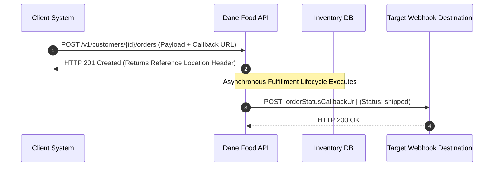

# Sequence Workflows

This sequence layout maps out how your external client system interacts with the core order gateway service, highlighting how the asynchronous webhook event notification handler functions once background order processing completes.

---

## Order Fulfillment Lifecycle

When a client application submits a payload to the order endpoint, the system validates the data models, assigns a transaction identifier, and drops the task into a background processing queue. Once fulfillment updates the state of that order, an automated callback triggers.

## Step-by-Step Processing

1. **Submission:** The client system pushes a JSON payload containing a valid customerId and an array of foodOrderLines to the API gateway.

2. **Immediate Acknowledgment:** The API validates the structural bounds of the request and immediately returns an HTTP 201 Created code containing a Location header to track the resource state.

3. **Asynchronous Execution:** The system matches requested line quantities against the distribution center's quantityOnHand reserves.

4. **Outbound Notification:** When the state of the order switches to shipped, the gateway actively calls the client's provided orderStatusCallbackUrl with a state update notification payload.
